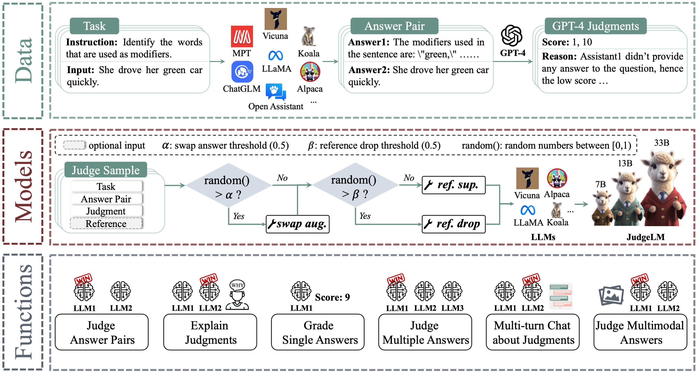
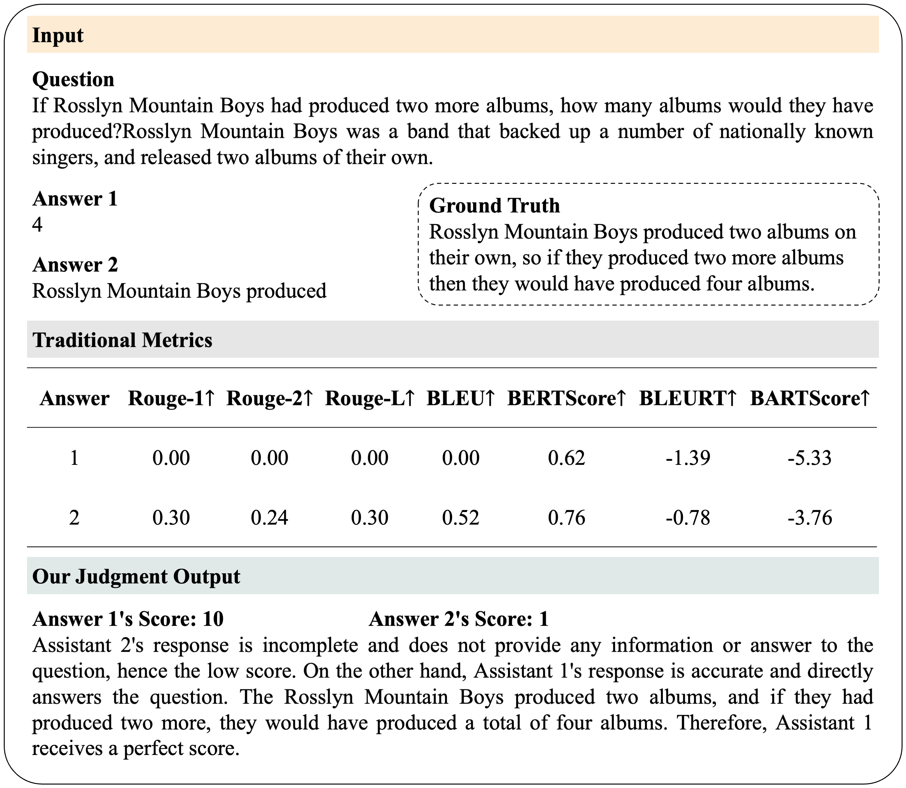
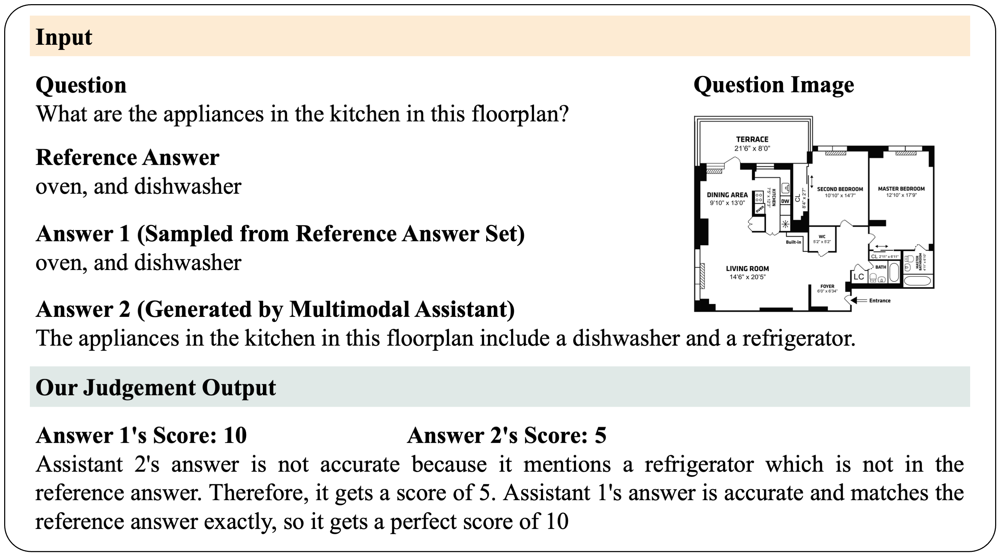
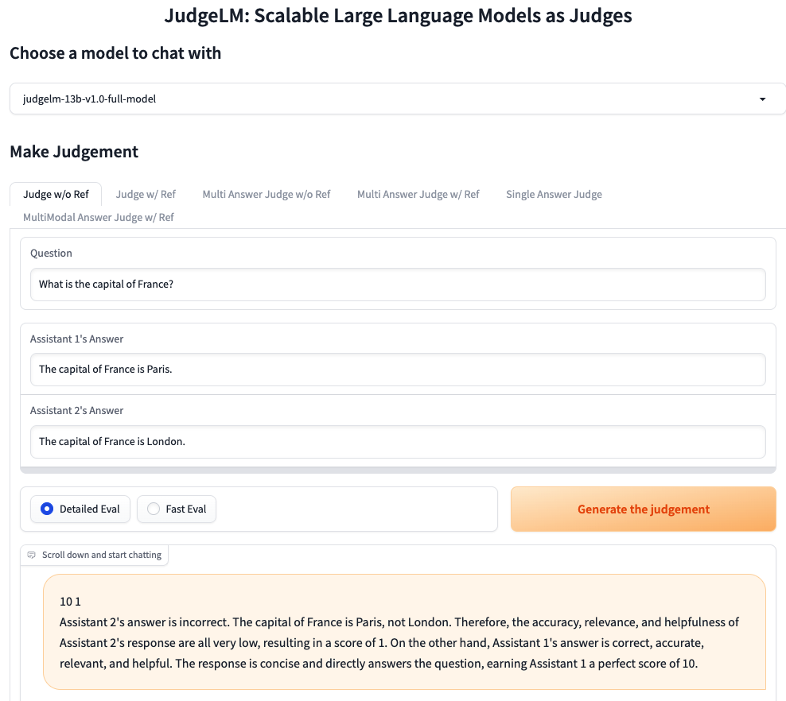

# JudgeLM: Fine-tuned Large Language Models are Scalable Judges


<a target="_blank" href="https://arxiv.org/abs/2310.17631">

</a>
<a target="_blank" href="https://https://github.com/baaivision/JudgeLM">

</a>
<a target="_blank" href="http://218.91.113.230:9004/">

</a>
<a target="_blank" href="https://huggingface.co/datasets/BAAI/JudgeLM-100K">

</a>
<a target="_blank" href="https://huggingface.co/BAAI/JudgeLM-7B-v1.0">

</a>
<a target="_blank" href="https://huggingface.co/BAAI/JudgeLM-13B-v1.0">

</a>
<a target="_blank" href="https://huggingface.co/BAAI/JudgeLM-33B-v1.0">

</a>
<a target="_blank" href="https://twitter.com/_akhaliq/status/1717718525958037799?s=61&t=Q73fac6D7gyJgMBfcxgPvA">

</a>
<br>

[Lianghui Zhu](https://github.com/Unrealluver)<sup>1,2</sup>, [Xinggang Wang](https://xwcv.github.io/)<sup>1</sup>, [Xinlong Wang](https://www.xloong.wang/)<sup>2</sup>
 
<sup>1</sup>[HUST](https://english.hust.edu.cn/), <sup>2</sup>[BAAI](https://www.baai.ac.cn/english.html)

## News


- [2025/01] JudgeLM is accepted by ICLR2025. 🎉 OpenReview page can be found [here](https://openreview.net/forum?id=xsELpEPn4A).

- [2023/10] We released **JudgeLM: Fine-tuned Large Language Models are Scalable Judges**. Check out the [paper](https://arxiv.org/abs/2310.17631).


## Overview



<details><summary>Abstract</summary> 
Evaluating Large Language Models (LLMs) in open-ended scenarios is challenging because existing benchmarks and metrics can not measure them comprehensively. To address this problem, we propose to fine-tune LLMs as scalable judges (JudgeLM) to evaluate LLMs efficiently and effectively in open-ended benchmarks. We first propose a comprehensive, large-scale, high-quality dataset containing task seeds, LLMs-generated answers, and GPT-4-generated judgments for fine-tuning high-performance judges, as well as a new benchmark for evaluating the judges. We train JudgeLM at different scales from 7B, 13B, to 33B parameters, and conduct a systematic analysis of its capabilities and behaviors. We then analyze the key biases in fine-tuning LLM as a judge and consider them as position bias, knowledge bias, and format bias. To address these issues, JudgeLM introduces a bag of techniques including swap augmentation, reference support, and reference drop, which clearly enhance the judge's performance. JudgeLM obtains the state-of-the-art judge performance on both the existing PandaLM benchmark and our proposed new benchmark. Our JudgeLM is efficient and the JudgeLM-7B only needs 3 mins to judge 5K samples with 8 A100 GPUs. JudgeLM obtains high agreement with the teacher judge, achieving an agreement exceeding 90% that even surpasses human-to-human agreement. JudgeLM also demonstrates extended capabilities in being judges of the single answer, multimodal models, multiple answers, and multi-turn chat.
</details>

JudgeLM is an open platform for training, serving, and evaluating scalable large language model judges.
- JudgeLM is a scalable language model judge, designed for evaluating LLMs in open-ended scenarios. It achieves an agreement exceeding 90\% that surpasses the human-to-human agreement.
- JudgeLM dataset contains 100K judge samples for training and 5K judge samples for validation. All the judge samples have the GPT-4-generated high-quality judgements.

JudgeLM's core features include:
- The training and evaluation code for state-of-the-art LLM judges. 
- The broad capacities to deal with extended tasks. (e.g., judges of the single answer, multimodal models,
multiple answers, and multi-turn chat)
- A distributed multi-model serving system with web UI.


## Contents
- [Install](#install)
- [Model Weights](#model-weights)
- [Evaluation](#evaluation)
- [Serving with Web GUI](#serving-with-web-gui)
- [Fine-tuning](#fine-tuning)
- [Citation](#citation)

## Install: From source

1. Clone this repository and navigate to the JudgeLM folder
```bash
git clone https://github.com/baaivision/JudgeLM
cd JudgeLM
```

2. Install Package
```bash
conda create -n judgelm python=3.10.10 -y
conda activate judgelm
pip3 install --upgrade pip 
pip3 install -e .
pip install flash-attn==2.0.4 --no-build-isolation
```

## Model Weights
JudgeLM is based on LLaMA and should be used under LLaMA's [model license](https://github.com/facebookresearch/llama/blob/main/LICENSE).

|                               Model                                | w/ reference? | Agreement↑ | Precision↑ | Recall↑ |  F1↑  | Consistency↑ |
|:------------------------------------------------------------------:|:-------------:|:----------:|:----------:|:-------:|:-----:|:------------:|
|   [**JudgeLM-7B**](https://huggingface.co/BAAI/JudgeLM-7B-v1.0)    |       ❎       |   81.11    |   69.67    |  78.39  | 72.21 |    83.57     |
|   [**JudgeLM-7B**](https://huggingface.co/BAAI/JudgeLM-7B-v1.0)    |       ✅       |   84.08    |   75.92    |  82.55  | 78.28 |    84.46     |
|  [**JudgeLM-13B**](https://huggingface.co/BAAI/JudgeLM-13B-v1.0)   |       ❎       |   84.33    |   73.69    |  80.51  | 76.17 |    85.01     |
|  [**JudgeLM-13B**](https://huggingface.co/BAAI/JudgeLM-13B-v1.0)   |       ✅       |   85.47    |   77.71    |  82.90  | 79.77 |    87.23     |
| [**JudgeLM-33B** 🔥](https://huggingface.co/BAAI/JudgeLM-33B-v1.0) |       ❎       |   89.03    |   80.97    |  84.76  | 82.64 |    91.36     |
|                       [**JudgeLM-33B** 🔥](https://huggingface.co/BAAI/JudgeLM-33B-v1.0)                       |       ✅       |   89.32    |   84.00    |  86.21  | 84.98 |    92.37     |


## Evaluation








JudgeLM can judge open-ended answers from LLMs, as well as the multimodal models.

See instructions for running JudgeLM at [judgelm/llm_judge](judgelm/llm_judge).

## Serving with Web GUI



We use gradio to provide web server and UI for users to evaluate LLMs' performance at open-ended tasks.
The demo can be tried [here](http://218.91.113.230:9004/).

See instructions for running JudgeLM web server at [judgelm/serve](judgelm/serve).

## Fine-tuning
### Data

The JudgeLM-100K dataset is available at [HuggingFace Datasets](https://huggingface.co/datasets/BAAI/JudgeLM-100K).

### Code and Hyperparameters
Our code is based on [Vicuna](https://github.com/lm-sys/FastChat) with additional support for judging answer pairs.
We use similar hyperparameters as the Vicuna.

| Hyperparameter | Global Batch Size | Learning rate | Epochs | Max length | Weight decay |
| --- | ---: | ---: | ---: | ---: | ---: |
| JudgeLM-13B | 128 | 2e-5 | 3 | 2048 | 0 |

### Fine-tuning JudgeLM-7B with Local GPUs


- You can use the following command to train JudgeLM-7B with 4 x A100 (40GB). Update `--model_name_or_path` with the actual path to Vicuna weights and `--data_path` with the actual path to JudgeLM data.
```bash
torchrun --nproc_per_node=4 --master_port=20001 judgelm/train/train_mem.py \
    --model_name_or_path="/share/project/lianghuizhu/vicuna-weights-collection-v1.3/vicuna-7b-v1.3" \
    --data_path /share/project/lianghuizhu/JudgeLM-Project/JudgeLM/judgelm/data/JudgeLM/judgelm_train_100k.jsonl \
    --bf16 True \
    --output_dir="/home/zhulianghui/ProjectC_ChatGPT/alpaca/output/judgelm-debug-evaluator" \
    --num_train_epochs 3 \
    --per_device_train_batch_size 1 \
    --per_device_eval_batch_size 1 \
    --gradient_accumulation_steps 32 \
    --evaluation_strategy no \
    --save_strategy steps \
    --save_steps 1000 \
    --save_total_limit 1 \
    --learning_rate 2e-5 \
    --weight_decay 0. \
    --warmup_ratio 0.03 \
    --lr_scheduler_type cosine \
    --logging_steps 1 \
    --fsdp "full_shard auto_wrap offload" \
    --fsdp_transformer_layer_cls_to_wrap "LlamaDecoderLayer" \
    --tf32 True \
    --model_max_length 2048 \
    --gradient_checkpointing True \
    --run_name 7B-full-model \
    --swap_aug_ratio 0.5 \
    --ref_drop_ratio 0.5
```

Tips:
- If you are using V100 which is not supported by FlashAttention, you can use the [memory-efficient attention](https://arxiv.org/abs/2112.05682) implemented in [xFormers](https://github.com/facebookresearch/xformers). Install xformers and replace `judgelm/train/train_mem.py` above with [judgelm/train/train_xformers.py](judgelm/train/train_xformers.py).
- If you meet out-of-memory due to "FSDP Warning: When using FSDP, it is efficient and recommended... ", see solutions [here](https://github.com/huggingface/transformers/issues/24724#issuecomment-1645189539).
- If you meet out-of-memory during model saving, see solutions [here](https://github.com/pytorch/pytorch/issues/98823).

## Acknowledgement :heart:
This project is based on Vicuna ([blog](https://vicuna.lmsys.org), [code](https://github.com/lm-sys/FastChat)), PandaLM ([paper](https://arxiv.org/abs/2306.05087), [code](https://github.com/WeOpenML/PandaLM)), LLM-Blender ([paper](https://arxiv.org/abs/2306.02561), [code](https://github.com/yuchenlin/LLM-Blender)). Thanks for their wonderful works.


## Citation
The code (training, serving, and evaluation) in this repository is mostly developed for or derived from the paper below.
Please cite it if you find the repository helpful.

```
@article{zhu2023judgelm,
      title={JudgeLM: Fine-tuned Large Language Models are Scalable Judges}, 
      author={Lianghui Zhu and Xinggang Wang and Xinlong Wang},
      year={2023},
      eprint={2310.17631},
      archivePrefix={arXiv},
      primaryClass={cs.CL}
}
```
